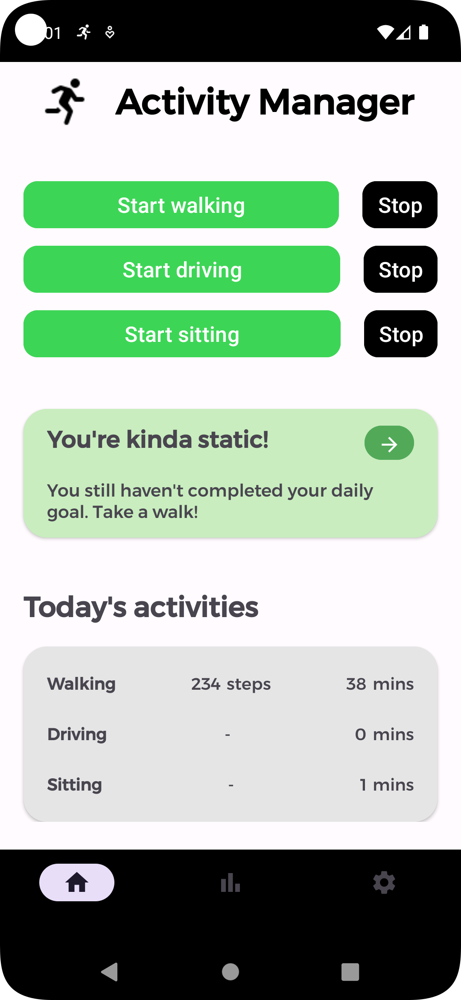
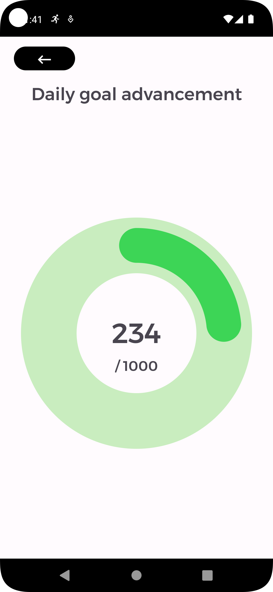
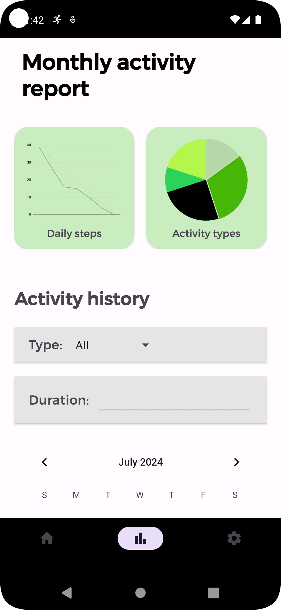
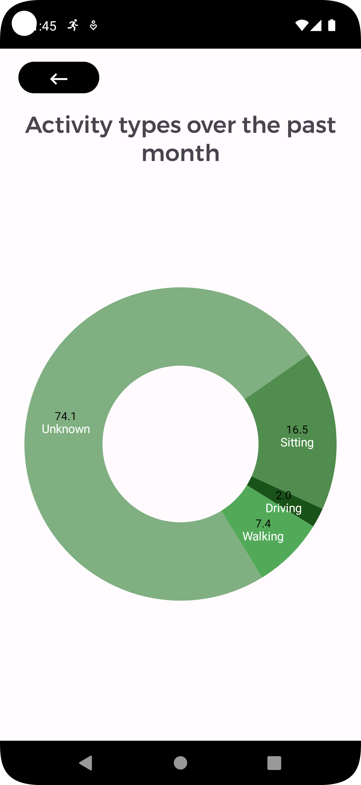
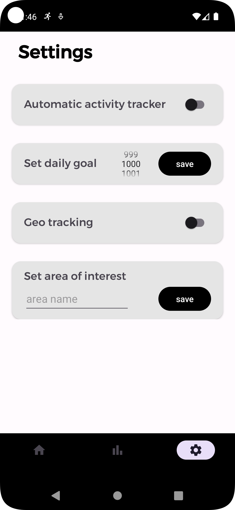

# Personal Physical Tracker
This project is part of the exam for the Mobile Applications Laboratory course at the IPIM faculty of the University of Bologna.

### Author
Leonardo Vorabbi

## Introduction
This application is designed to monitor the user's physical activity, including walking, staying still, and driving. It allows users to record various physical activities, track their steps, and measure the distance traveled. Users can also view their activity history in a calendar format and analyze statistics through pie charts and line graphs.

Additional features include periodic notifications to encourage activity and automatic activity recognition using device sensors.

## Application Overview

### Home Section
- Start and stop activities manually.
- Displays daily activity summaries, such as total steps and duration.
- Indicates whether the daily step goal is achieved.

<div style="display: flex;">
  
  
</div>

### Stats Section
- Allows users to monitor activity statistics.
- Includes a pie chart showing activity distribution and a line chart for daily steps.
- Filters to display specific activity types or durations.

<div style="display: flex;">
  
  
</div>

### Settings Section
- Enable/disable automatic activity recognition.
- Configure daily step goal (default: 2500 steps).
- Manage geofencing to track predefined areas of interest.

<div style="display: flex;">
  
</div>

---

## Activity Recording
Activities are recorded using dedicated services, such as `WalkingActivityService` for tracking steps and `DrivingActivityService` for monitoring driving activities. Data is saved in the database at the end of each session.

---

## Viewing Statistics
Users can view and filter activities in `StatsFragment`. Graphs are generated using the MPAndroidChart library.

---

## Activity Recognition
Automatic activity recognition is implemented using Google Activity Recognition APIs, enabling real-time tracking of walking, running, driving, and stillness.

---

## GeoTracking
The app uses Google Location Services to monitor entry and exit from predefined areas of interest (geofences). Notifications are sent based on geofence events.

---

## Periodic Notifications
Notifications remind users to check daily statistics or encourage movement after periods of inactivity. These are managed by `NotificationBroadcastReceiver` and triggered using Android's `AlarmManager`.

---

## Instructions for Execution
Clone the repository:
```bash
git clone https://github.com/leovora/captcha_solver.git
